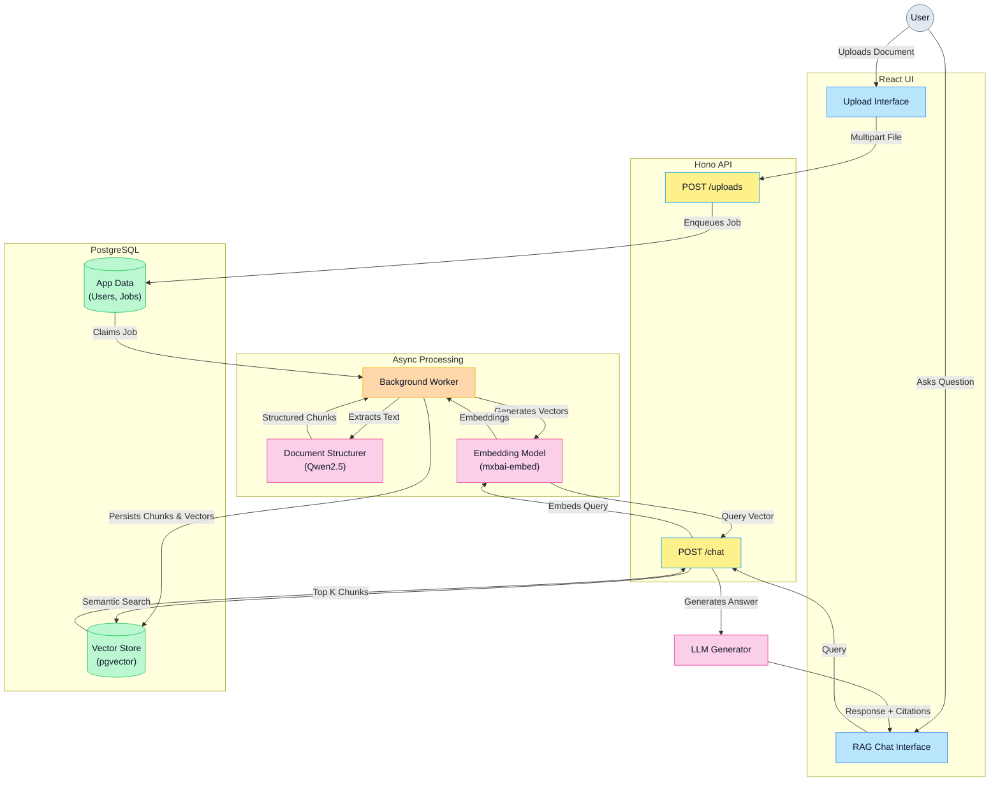
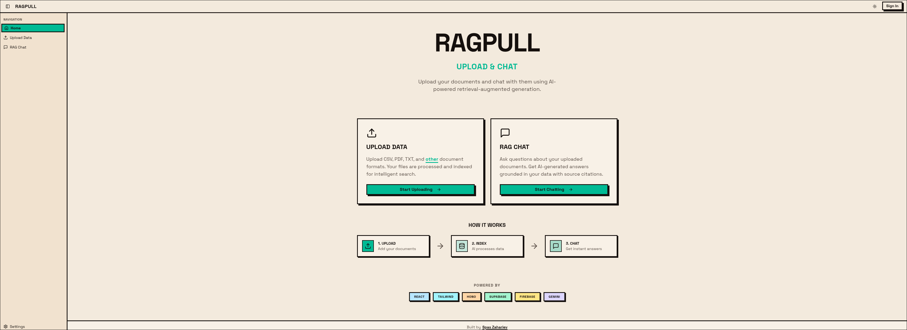
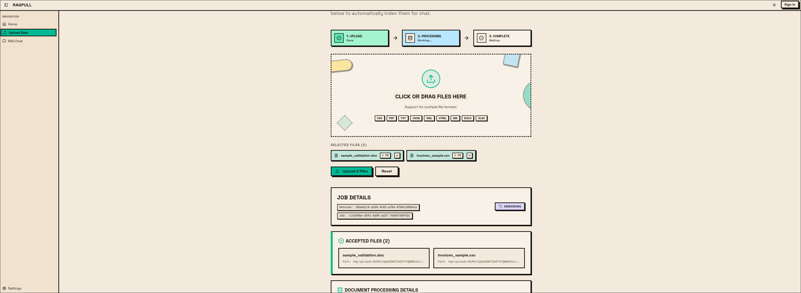
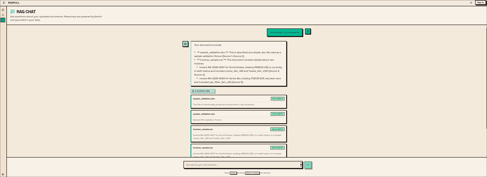

# RagPull: Full-Stack RAG Application

An end-to-end Retrieval-Augmented Generation (RAG) platform built to demonstrate a production-ready, local-first architecture for document ingestion, semantic search, and AI-driven chat. 

This project was built to showcase a robust technical foundation integrating modern frontend frameworks with a scalable, async backend processing pipeline.

## 🚀 Key Features

*   **Asynchronous Document Ingestion:** A robust backend worker queue built on PostgreSQL orchestrates the extraction, chunking, and embedding of various document types (PDF, CSV, TXT, etc.).
*   **Local AI Integration:** Leverages local LLMs via Ollama (`qwen2.5:14b-instruct` for document structuring, `mxbai-embed-large` for embeddings) for entirely private, offline processing.
*   **RAG Chat Interface:** An intuitive chat UI where users can query their uploaded knowledge base. The AI responses include precise citations, revealing exactly which document chunks and vector match percentages informed the answer.
*   **Production-Ready Architecture:** Designed with a decoupled frontend (React/Vite) and backend (Hono API), complete with authentication (Firebase) and a relational database (PostgreSQL/Drizzle), ensuring a smooth path from local development to cloud deployment.

## 🛠️ Tech Stack

*   **Frontend:** React, TypeScript, Vite, Tailwind CSS, ShadCN UI
*   **Backend:** Node.js, Hono API, background worker processes
*   **Database & ORM:** PostgreSQL, Drizzle ORM (handling both application data and vector storage/queues)
*   **AI & Embeddings:** Ollama (Local LLMs), pluggable provider architecture
*   **Authentication:** Firebase Auth (with local emulator support)
*   **Deployment:** Cloudflare Pages & Workers ready

## ⚡ Architecture & Processing Flow

The core of RagPull is its asynchronous ingestion pipeline and subsequent semantic search capabilities. Here is how data flows through the system:



## 📸 Application Showcase

*(Please take the screenshots as discussed and place them in the `docs/images/` folder. They will automatically render here once added).*

### The Dashboard
The central hub for navigating the application.



### Data Ingestion
The interface for uploading documents, complete with real-time, granular progress tracking as the background worker processes the queue.



### Semantic Search & Chat
The conversational interface for querying the knowledge base. Notice the "Sources" expansion, which provides transparency into the RAG process by showing the exact matched chunks.



## 💻 Local Development

Everything needed to run RagPull is containerized or embedded for a seamless local developer experience.

1.  **Install dependencies:**
    ```bash
    pnpm install
    ```
2.  **Start all services:**
    This single command spins up the frontend, backend API, async worker, embedded PostgreSQL database, and local Firebase Auth emulator.
    ```bash
    pnpm run dev
    ```
3.  **Local AI Setup:**
    Ensure Ollama is installed and the required models are pulled:
    ```bash
    ollama pull qwen2.5:14b-instruct
    ollama pull mxbai-embed-large
    ```

For detailed setup, port management, and production deployment guides, refer to the `docs/` directory.
