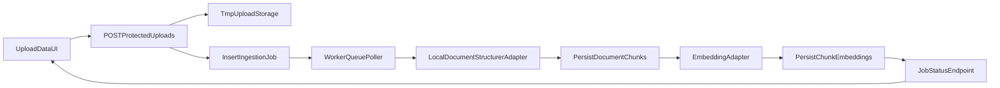

# Upload Data Processing Pipeline Plan

Build an end-to-end backend pipeline for the uploaded files from the Upload Data page: files remain staged in temporary storage initially, then are processed asynchronously through (1) document structuring ("like GCP Document AI, but local") and (2) embedding generation, with outputs stored in Postgres.

## Phase 1: Data Layer and Job Model

### 1) Extend database schema for ingestion and embeddings

- Add ingestion tables under `app` schema in [`/home/spas/dev/js-projects/rag-pulled/server/src/schema/`](/home/spas/dev/js-projects/rag-pulled/server/src/schema/) (new files, then re-export in DB loader):
  - `ingestion_jobs`: queue/job metadata (`id`, `user_id`, `upload_session_id`, `status`, `attempt_count`, `max_attempts`, `next_run_at`, `error`, timestamps)
  - `uploaded_documents`: one row per accepted uploaded file (`job_id`, `original_name`, `stored_path`, `mime_type`, `size_bytes`, `structured_status`)
  - `document_chunks`: normalized structured output chunks (`document_id`, `chunk_index`, `text`, optional page/section metadata JSON)
  - `chunk_embeddings`: vector payload per chunk (`chunk_id`, `embedding_model`, `embedding_dim`, `embedding` numeric array/JSON, timestamps)
- Update DB schema import wiring in [`/home/spas/dev/js-projects/rag-pulled/server/src/lib/db.ts`](/home/spas/dev/js-projects/rag-pulled/server/src/lib/db.ts) so Drizzle includes new schema files (not only `users`).
- Keep queue in Postgres (selected direction) to avoid introducing Redis/BullMQ in this phase.

### 2) Define status and typing contracts

- Introduce shared backend types in new `server/src/lib/ingestion/types.ts` for:
  - job lifecycle states (`queued`, `processing_structure`, `processing_embeddings`, `completed`, `failed`)
  - structured-document payload contract (document-level fields + chunk list)
  - embedding payload contract (vector dimensions + model id)
- Ensure route responses expose ingestion IDs for UI polling.

## Phase 2: Upload API -> Queue Enqueue

### 3) Convert upload endpoint from "store-only" to "store + enqueue"

- Update [`/home/spas/dev/js-projects/rag-pulled/server/src/api.ts`](/home/spas/dev/js-projects/rag-pulled/server/src/api.ts) protected `/uploads` route:
  - keep current file validation and temp storage behavior via [`/home/spas/dev/js-projects/rag-pulled/server/src/lib/upload-storage.ts`](/home/spas/dev/js-projects/rag-pulled/server/src/lib/upload-storage.ts)
  - after successful file save, create one ingestion job + related uploaded_document rows in a DB transaction
  - return `uploadSessionId`, `jobId`, and initial `status: queued`
- Add protected status endpoint (e.g. `GET /api/v1/protected/uploads/:jobId/status`) to return progress and file-level failures.

### 4) Keep storage abstraction compatible with future object storage

- Slightly extend [`/home/spas/dev/js-projects/rag-pulled/server/src/lib/upload-storage.ts`](/home/spas/dev/js-projects/rag-pulled/server/src/lib/upload-storage.ts) metadata to ensure worker can resolve absolute path safely from stored relative path.
- Preserve current `tmp/uploads/...` path strategy for now; do not introduce S3/GCS yet.

## Phase 3: Background Worker and Queue Engine

### 5) Implement a Postgres-backed worker loop

- Add new worker entrypoint (e.g. `server/src/worker.ts`) and queue module (`server/src/lib/ingestion/queue.ts`):
  - poll due jobs (`status=queued`, `next_run_at <= now`)
  - claim jobs atomically (single-row lock/update) to avoid double-processing
  - process each document sequentially per job
  - retry with exponential backoff until `max_attempts`, then mark `failed`
- Add npm script in [`/home/spas/dev/js-projects/rag-pulled/server/package.json`](/home/spas/dev/js-projects/rag-pulled/server/package.json) for worker (`pnpm run worker:dev`), and optionally wire root [`/home/spas/dev/js-projects/rag-pulled/scripts/run-dev.js`](/home/spas/dev/js-projects/rag-pulled/scripts/run-dev.js) to launch worker alongside backend/frontend in local dev.

### 6) Processing algorithm (pipeline-first adapter architecture)

- Create adapter interfaces:
  - `DocumentStructurer` (`structure(filePath, mimeType) -> structured chunks`)
  - `EmbeddingGenerator` (`embed(chunks[]) -> vectors[]`)
- Provide initial concrete implementations:
  - **Structurer (minimal deterministic parser now):**
    - CSV: parse rows/cells into text chunks
    - Markdown: split by heading/paragraph blocks
    - XLS/XLSX/PDF: fallback text extraction path or file-level "unsupported-for-structure" status placeholder
  - **Embedding (adapter stub now):**
    - deterministic placeholder vector generation (fixed length) behind adapter contract for immediate end-to-end persistence/testing
- Persist structured chunks first, then embeddings linked by `chunk_id`.

## Phase 4: UI Integration for Job Visibility

### 7) Update Upload page to show processing state

- Extend API client contracts in [`/home/spas/dev/js-projects/rag-pulled/ui/src/lib/serverComm.ts`](/home/spas/dev/js-projects/rag-pulled/ui/src/lib/serverComm.ts) with `jobId` + status endpoint response types.
- Update [`/home/spas/dev/js-projects/rag-pulled/ui/src/pages/UploadData.tsx`](/home/spas/dev/js-projects/rag-pulled/ui/src/pages/UploadData.tsx) to:
  - show queued/processing/completed/failed state after upload
  - poll status endpoint until terminal state
  - display per-file/document errors without losing existing upload success/reject info

## Phase 5: Swap in Real Local AI Agents (next increment-ready)

### 8) Keep adapters pluggable for immediate model wiring

- Add env-based adapter selection in server env loader (document structurer provider + embedding provider IDs) so real local models can be introduced without route/schema rewrites.
- Next increment will replace placeholder adapters with concrete local model integrations while preserving queue, DB schema, and API contracts.

## End-to-End Flow (Target)

## Files to Change/Create

- Update: [`/home/spas/dev/js-projects/rag-pulled/server/src/api.ts`](/home/spas/dev/js-projects/rag-pulled/server/src/api.ts)
- Update: [`/home/spas/dev/js-projects/rag-pulled/server/src/lib/upload-storage.ts`](/home/spas/dev/js-projects/rag-pulled/server/src/lib/upload-storage.ts)
- Update: [`/home/spas/dev/js-projects/rag-pulled/server/src/lib/db.ts`](/home/spas/dev/js-projects/rag-pulled/server/src/lib/db.ts)
- Update: [`/home/spas/dev/js-projects/rag-pulled/server/package.json`](/home/spas/dev/js-projects/rag-pulled/server/package.json)
- Update (optional local-dev orchestration): [`/home/spas/dev/js-projects/rag-pulled/scripts/run-dev.js`](/home/spas/dev/js-projects/rag-pulled/scripts/run-dev.js)
- Update: [`/home/spas/dev/js-projects/rag-pulled/ui/src/lib/serverComm.ts`](/home/spas/dev/js-projects/rag-pulled/ui/src/lib/serverComm.ts)
- Update: [`/home/spas/dev/js-projects/rag-pulled/ui/src/pages/UploadData.tsx`](/home/spas/dev/js-projects/rag-pulled/ui/src/pages/UploadData.tsx)
- Create: `server/src/schema/ingestion-jobs.ts`
- Create: `server/src/schema/uploaded-documents.ts`
- Create: `server/src/schema/document-chunks.ts`
- Create: `server/src/schema/chunk-embeddings.ts`
- Create: `server/src/lib/ingestion/types.ts`
- Create: `server/src/lib/ingestion/queue.ts`
- Create: `server/src/lib/ingestion/processor.ts`
- Create: `server/src/lib/ingestion/adapters/document-structurer.ts`
- Create: `server/src/lib/ingestion/adapters/embedding-generator.ts`
- Create: `server/src/worker.ts`
- Create plan doc file: `docs/features/0001_UPLOAD_INGESTION_PIPELINE_PLAN.md`
